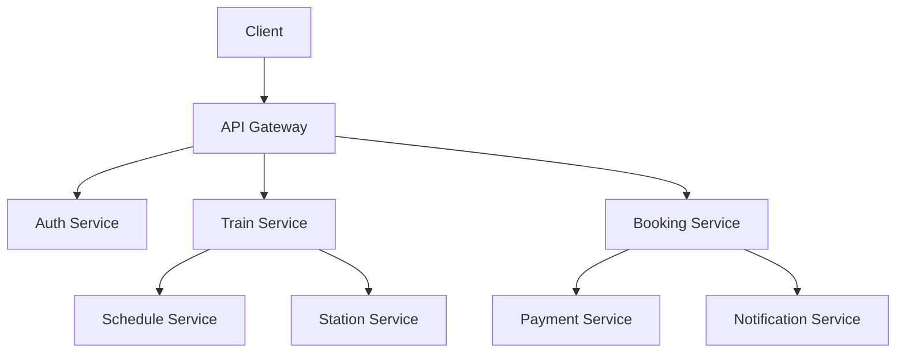

<h1 align="center">Prem Singh</h1>

<p align="center">
  <b>Backend Developer</b> · Java · Spring Boot · Microservices
</p>

<p align="center">
  
</p>

<p align="center">
  <a href="https://github.com/shekhawatjii003"></a>
  <a href="YOUR_LINKEDIN_URL"></a>
  <a href="mailto:YOUR_EMAIL"></a>
</p>

---

## About Me

I'm a backend developer who enjoys understanding how real-world systems work under the hood: authentication, database design, API design, concurrency, and scalability. I build projects that mirror production problems and practice DSA regularly to sharpen my problem-solving.

**Currently**

- Building a **Train Booking System** inspired by IRCTC, using a microservices architecture
- Deepening my knowledge of **Spring Security and JWT authentication**
- Practicing **Data Structures & Algorithms** in C++
- Learning **Redis, Kafka, and Docker** for scalable, event-driven systems

**Looking for:** Backend Software Engineering roles and open-source collaboration.

---

## Tech Stack

| Category | Technologies |
|---|---|
| **Languages** | Java, C++, Python, SQL |
| **Backend** | Spring Boot, Spring Security, Spring Data JPA, Hibernate, REST APIs |
| **Architecture** | Microservices, API Gateway, JWT-based auth |
| **Database** | MySQL, Database Design, Normalization, Indexing |
| **Tools** | Git, GitHub, IntelliJ IDEA, Docker, Linux |

<p>
  
</p>

---

## Featured Project: Train Booking System

A backend platform modeled on IRCTC, built to explore how a large-scale railway reservation system can be designed with modern backend technologies.

**Status:** In active development

**Core modules**

- **Station, Train & Schedule Management:** stations, trains, routes, stops, and timetables
- **Coach & Seat Management:** coach types and seat inventory
- **Booking Service:** reservation flow with a focus on consistency under concurrent requests
- **Authentication & Authorization:** Spring Security with JWT
- **Tatkal Booking:** design for high-concurrency, time-critical booking windows

**Tech:** `Java` `Spring Boot` `Spring Security` `JWT` `MySQL` `JPA/Hibernate` `REST` `Microservices` `Docker`

### Target Architecture



**Design concerns I'm working through:** high traffic, concurrent bookings, database consistency, caching, event-driven communication, fault tolerance, and scalability.

> Repository: [`train-booking-system`](https://github.com/shekhawatjii003/YOUR_REPO_NAME)

---

## Problem Solving

I practice DSA in **C++**, focusing on clean, optimized solutions and a clear understanding of time and space complexity.

**Topics:** Arrays · Strings · Two Pointers · Sliding Window · Binary Search · Sorting · Hashing · Linked Lists · Stacks & Queues · Trees · Graphs · Recursion · Backtracking · Greedy · Dynamic Programming

---

## Learning Roadmap

```text
Java → Spring Boot → REST APIs → Spring Security + JWT → Microservices
     → Redis → Kafka → Docker → CI/CD → Scalable Backend Systems
```

**SQL & databases:** JOINs, subqueries, aggregations, window functions, schema design, normalization, indexing.

---

## 2026 Goals

- [ ] Complete the Train Booking microservices project
- [ ] Build production-style Spring Boot applications
- [ ] Master Spring Security and JWT
- [ ] Learn Redis and Apache Kafka
- [ ] Improve Docker and CI/CD skills
- [ ] Strengthen DSA and SQL
- [ ] Make open-source contributions
- [ ] Prepare for Backend Software Engineering roles

---

## Contribution Snake

<p align="center">
  <picture>
    <source media="(prefers-color-scheme: dark)" srcset="https://raw.githubusercontent.com/shekhawatjii003/shekhawatjii003/output/github-contribution-grid-snake-dark.svg" />
    <source media="(prefers-color-scheme: light)" srcset="https://raw.githubusercontent.com/shekhawatjii003/shekhawatjii003/output/github-contribution-grid-snake.svg" />
    
  </picture>
</p>

---

<p align="center">
  <i>Build. Learn. Solve. Repeat.</i>
</p>
