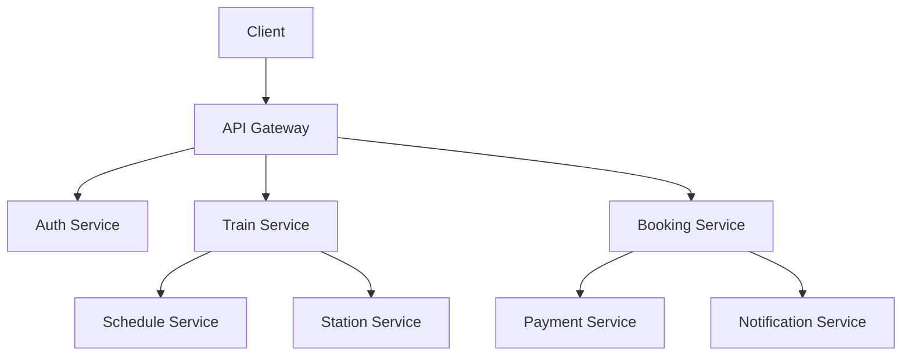

<p align="center">
  
</p>

<p align="center">
  
</p>

<p align="center">
  <a href="https://github.com/shekhawatjii003"></a>
  <a href="YOUR_LINKEDIN_URL"></a>
  <a href="mailto:YOUR_EMAIL"></a>
  
</p>


## 🧑‍💻 About Me

I'm a **backend developer** who enjoys understanding how real-world systems work under the hood: authentication, database design, API design, concurrency, and scalability. I build projects that mirror production problems and practice DSA regularly to sharpen my problem-solving.

```bash
$ whoami
prem_singh — backend developer

$ cat current_focus.txt
├── Building   : Train Booking System (IRCTC-inspired, microservices)
├── Learning   : Spring Security + JWT, Redis, Kafka, Docker
├── Practicing : Data Structures & Algorithms in C++
└── Looking for: Backend Software Engineering roles & open-source collaboration
```


## 🛠️ Tech Stack

### Languages
<p>


</p>

### Backend & Frameworks
<p>


</p>

### Databases & Caching
<p>


</p>

### DevOps, Messaging & OS
<p>


</p>

### Tools
<p>


</p>

<p align="center">
  
</p>

> 🔄 **Actively learning:** Redis · Apache Kafka · Docker · CI/CD (GitHub Actions)


## 🚆 Featured Project: Train Booking System

A backend platform modeled on **IRCTC**, built to explore how a large-scale railway reservation system can be designed with modern backend technologies.

**Status:** 🚧 In active development

| Module | What it covers |
|---|---|
| 🚉 **Station & Train Management** | Stations, trains, routes, stops |
| 📅 **Schedule Management** | Timetables and train schedules |
| 💺 **Coach & Seat Management** | Coach types and seat inventory |
| 🎫 **Booking Service** | Reservation flow with consistency under concurrent requests |
| 🔐 **Auth & Security** | Spring Security with JWT-based authentication and authorization |
| ⚡ **Tatkal Booking** | Design for high-concurrency, time-critical booking windows |

<p>


</p>

### Target Architecture



**Design concerns I'm working through:** high traffic, concurrent bookings, database consistency, caching, event-driven communication, fault tolerance, and scalability.

> 📂 Repository: [`train-booking-system`](https://github.com/shekhawatjii003/YOUR_REPO_NAME)


## 🧠 Problem Solving

I practice DSA in **C++**, focusing on clean, optimized solutions and a clear understanding of time and space complexity.

`Arrays` `Strings` `Two Pointers` `Sliding Window` `Binary Search` `Sorting` `Hashing` `Linked Lists` `Stacks & Queues` `Trees` `Graphs` `Recursion` `Backtracking` `Greedy` `Dynamic Programming`

**SQL & databases:** JOINs · Subqueries · Aggregations · Window Functions · Schema Design · Normalization · Indexing


## 📚 Learning Roadmap

```text
Java → Spring Boot → REST APIs → Spring Security + JWT → Microservices
     → Redis → Kafka → Docker → CI/CD → Scalable Backend Systems
```

## 🎯 2026 Goals

- [ ] Complete the Train Booking microservices project
- [ ] Build production-style Spring Boot applications
- [ ] Master Spring Security and JWT
- [ ] Learn Redis and Apache Kafka
- [ ] Improve Docker and CI/CD skills
- [ ] Strengthen DSA and SQL
- [ ] Make open-source contributions
- [ ] Prepare for Backend Software Engineering roles


## 🔥 Contribution Streak

<p align="center">
  
</p>

## 🐍 Contribution Snake

<p align="center">
  <picture>
    <source media="(prefers-color-scheme: dark)" srcset="https://raw.githubusercontent.com/shekhawatjii003/shekhawatjii003/output/github-contribution-grid-snake-dark.svg" />
    <source media="(prefers-color-scheme: light)" srcset="https://raw.githubusercontent.com/shekhawatjii003/shekhawatjii003/output/github-contribution-grid-snake.svg" />
    
  </picture>
</p>


## 🤝 Let's Connect

I'm open to **backend engineering opportunities** and collaboration on interesting projects.

<p align="center">
  <a href="YOUR_LINKEDIN_URL"></a>
  <a href="mailto:YOUR_EMAIL"></a>
</p>

<p align="center">
  <i>"Build. Learn. Solve. Repeat."</i>
</p>

<p align="center">
  
</p>
